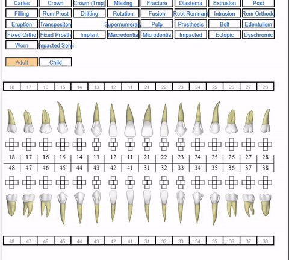
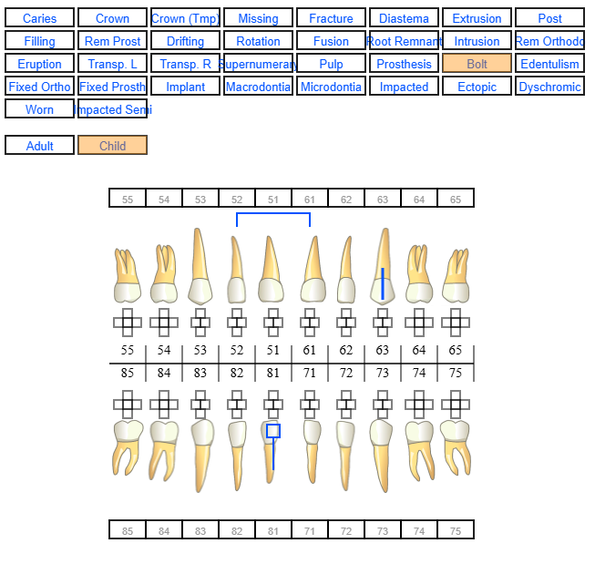

# Odontogram
A virtual Odontogram in JavaScript.

This is a work in progress, If you, dear reader, think you can make some improvements please feel free.

### Note
Not many changes have happend to this repo for the last couple of months, I have been very busy in my professional life. However, I will slowly start to update the code base. 

First thing I will do is to create a control menu for the system.

### Adult

### Child

